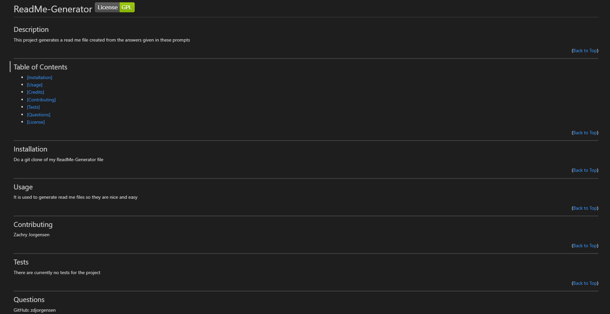

  
  #  ReadMe-Generator 

  ## About the Project
  
  

  For the 9th challenge `Professional README Generator`, I used the provided code and added to it to create a README file using `Javascript`, `JQUERY`, and `NodeJS`. It is created with a series of prompts in the console after running `node index.js`. The answers from the prompts are then put into the generateMarkdown file to create a README file.

  This can be used to simplify creating a README file and to make the process easier for the user because they do not have to create the file they only have to answer a few questions.

  The hardest part of this challenge was getting the lisence's to work. It took me awhile to figure out how to track which lisence was choosen and use that choice to change the link and badge icon in the README file. For this challenge, I used google, and previous activities, and previous Zoom recordings to help figure out how to complete the challenge. For some reason the image on this README file some times works and other times does not load correctly.

  
(<a href="#top">Back to Top</a>)

  

  ## Table of Contents
   <ul>
    <li> <a href="#installation"> [Installation]</a> </li>
    <li> <a href="#usage"> [Usage]</a> </li>
    <li> <a href="#contributing"> [Contributing]</a> </li>
    <li> <a href="#questions"> [Questions]</a> </li>
    <li> <a href="#license"> [License]</a> </li>
   </ul>

   
(<a href="#top">Back to Top</a>)

  

  
  

  ## Installation 
  To install this repo run git clone in the terminal followed by the SSH link.

  
(<a href="#top">Back to Top</a>)

  

  

  ## Usage
  This repo can be used to generate a README file based on answers to prompts in the command terminal.

  
(<a href="#top">Back to Top</a>)

  

  

  ## Contributing
  Zachry Jorgensen

  
(<a href="#top">Back to Top</a>)

  

  

  ## Questions
  GitHub: https://github.com/zdjorgensen
  
  Email: z.d.jorgensen@gmail.com

  
(<a href="#top">Back to Top</a>)

  

  

  ## License
  No License

  
(<a href="#top">Back to Top</a>)

  